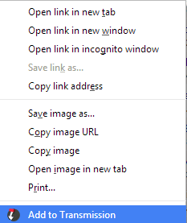
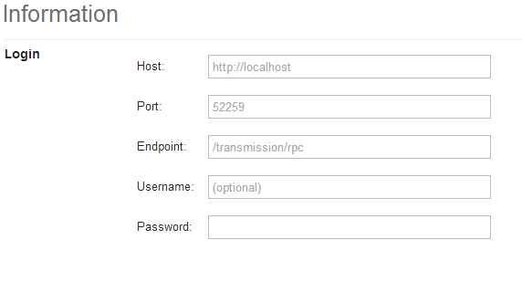

transmission-context-menu
===

This Chrome extensions add a context menu on links for them to be added to transmission.

Installation
---

1. Download the [latest release's .crx file](https://github.com/vohof/chrome-transmission-context-menu/releases)
2. Go to `chrome://extensions/`
3. Drag the *crx* file to that page.

Usage
---

1. Fill in the options page: 
2. Right click on a magnet/torrent link
3. Choose `Add to Transmission`
4. voilà!
